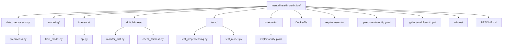
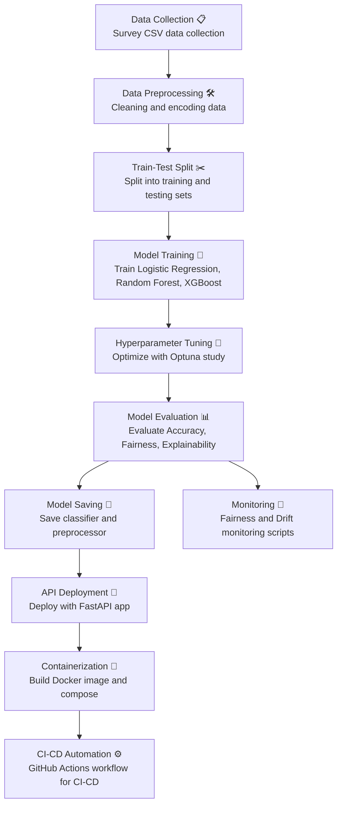

# Mental Health Prediction from Online Survey
Team Members: Phoebe Gao, Yina Liang Li, Carol Wang, Yuri Xu, and Qian Zhao.

**Problem Statement**

Mental health issues, such as anxiety and depression, are increasingly prevalent, especially in the workplace. Early prediction and intervention can significantly improve individuals' well-being and productivity.
In this project, we aim to predict whether someone is likely to seek treatment for mental health conditions based on their lifestyle, work environment, and demographic information.

**Dataset Description**

Source: Kaggle – Mental Health in Tech Survey

Key Features:  
- Demographics: Age, Gender, Country 
- Workplace Factors: Remote work, Company size, Mental health benefits, Work interference
- Medical History: Family mental illness, Previous diagnosis, Past treatment
- Perceptions and Awareness: Comfort discussing mental health, Employer support
  
Target Variable:
- treatment: Whether the individual has sought treatment for a mental health condition (Yes/No)

## Project Structure Overview

**Quick Start Guide**

- Install Requirements: pip install -r requirements.txt

- Local Development
1. Preprocess Data: python data_preprocessing/preprocess.py
2. Train Model: python modeling/train_model.py
3. Run Fairness and Drift Monitoring: python drift_fairness/check_fairness.py
                                      python drift_fairness/monitor_drift.py
4. Launch FastAPI App: cd inference ,uvicorn api:app --reload, The API will be available at: http://127.0.0.1:8000/docs

- Docker Deployment
1. Build Docker Image:docker build -t mental-health-api .
2. Run Docker Container: docker run -p 8000:8000 mental-health-api

-  Continuous Integration (CI)  
Every push to the main branch triggers the GitHub Actions workflow to:

  1.Automatically build the Docker image
  
  2. Run unit tests in /tests/
     
  3. Validate the FastAPI server  
You can find the workflow file in .github/workflows/ci.yml.

**Key Results**

- Achieved 90% overall test accuracy on the mental health treatment prediction task.
- Implemented fairness auditing with demographic parity and equalized odds difference metrics.
- Deployed Dockerized FastAPI API and integrated CI/CD with GitHub Actions.
- Set up drift detection using Evidently AI for continuous monitoring.

**Project End-to-End Pipeline**

