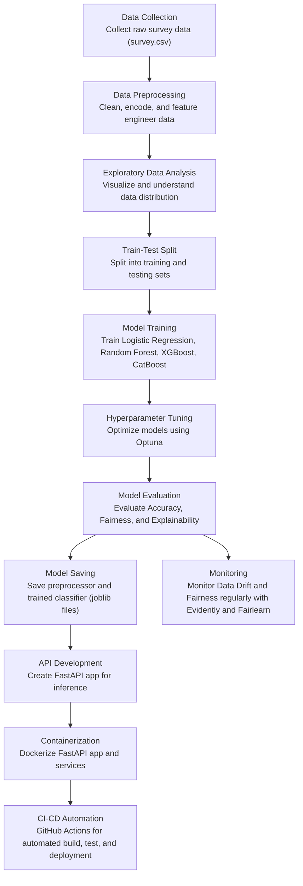

# Mental Health Prediction from Online Survey
Team Members: Phoebe Gao, Yina Liang Li, Carol Wang, Yuri Xu, and Qian Zhao.

**Remark:**
All project code has been modularized into clean `.py` files with proper docstring to support production use and future scalability.  
In addition, for this mental health prediction project and its associated dataset, **all methodologies, outputs, and insights have been fully documented and explained inside the `Notebooks with Insights/` folder**.  
This ensures a transparent and comprehensive view of the entire modeling and deployment process.

**Problem Statement**

Mental health issues, such as anxiety and depression, are increasingly prevalent, especially in the workplace.
Early prediction and intervention can significantly improve individuals' well-being and productivity.
In this project, we aim to predict whether an individual is likely to seek treatment for mental health conditions based on survey data, including information about their lifestyle, work environment, and demographic characteristics.
Early identification can help employers and healthcare providers offer better support and resources to those in need.

**Dataset Description**

Source: Kaggle – Mental Health in Tech Survey

Key Features:  
- Demographics: Age, Gender, Country 
- Workplace Factors: Remote work, Company size, Mental health benefits, Work interference
- Medical History: Family mental illness, Previous diagnosis, Past treatment
- Perceptions and Awareness: Comfort discussing mental health, Employer support
  
Target Variable:
- treatment: Whether the individual has sought treatment for a mental health condition (Yes/No)

**Project Structure Overview**

```mermaid
flowchart TD
    A1[mental-health-prediction/] --> B1[data_preprocessing/]
    B1 --> B2[cleaning_utils.py]
    B1 --> B3[preprocess.py]
    B1 --> B4[X_clean.csv]
    B1 --> B5[y_clean.csv]

    A1 --> C1[drift_fairness/]
    C1 --> C2[check_fairness.py]
    C1 --> C3[monitor_drift.py]
    C1 --> C4[feature_drift_report.html]
    C1 --> C5[simulate_data.py]
    C1 --> C6[simulated_current.csv]

    A1 --> D1[Experiments/]
    D1 --> D2[train_catboost.py]
    D1 --> D3[train_label_propagation.py]
    D1 --> D4[train_logistic_regression.py]
    D1 --> D5[train_random_forest.py]
    D1 --> D6[train_self_training.py]
    D1 --> D7[train_xgboost.py]

    A1 --> E1[inference/]
    E1 --> E2[api.py]

    A1 --> F1[modeling/]
    F1 --> F2[train_model.py]
    F1 --> F3[pseudo_labeling.py]
    F1 --> F4[best_xgb_params.json]
    F1 --> F5[best_xgb_pipeline.pkl]
    F1 --> F6[classifier.pkl]
    F1 --> F7[preprocessor.pkl]
    F1 --> F8[explainer.pkl]
    F1 --> F9[X_train_final.csv]
    F1 --> F10[X_test_final.csv]
    F1 --> F11[y_train_final.csv]
    F1 --> F12[y_test_final.csv]

    A1 --> G1[tests/]
    G1 --> G2[test_api.py]
    G1 --> G3[test_model.py]
    G1 --> G4[test_preprocessing.py]

    A1 --> H1[mlruns/]

    A1 --> I1[.github/workflows/]
    I1 --> I2[ci.yml]

    A1 --> J1[dockerfile]
    A1 --> J2[docker-compose.yml]
    A1 --> J3[requirements.txt]
    A1 --> J4[conftest.py]
    A1 --> J5[README.md]
    A1 --> J6[survey.csv]
    A1 --> J7[survey_encoded.csv]

```

**Quick Start Guide**

- Install Requirements: pip install -r requirements.txt

- Local Development
1. Preprocess Data: python data_preprocessing/preprocess.py
2. Train Model: python modeling/train_model.py
3. Run Fairness and Drift Monitoring: python drift_fairness/check_fairness.py
                                      python drift_fairness/monitor_drift.py
4. Launch FastAPI App: cd inference ,uvicorn api:app --reload, The API will be available at: http://127.0.0.1:8000/docs

- Docker Deployment
1. Build Docker Image:docker build -t mental-health-api .
2. Run Docker Container: docker run -p 8000:8000 mental-health-api

-  Continuous Integration (CI)  
Every push to the main branch triggers the GitHub Actions workflow to:

  1.Automatically build the Docker image
  
  2. Run unit tests in /tests/
     
  3. Validate the FastAPI server  
You can find the workflow file in .github/workflows/ci.yml.

**Project End-to-End Pipeline**

**Methodology Overview**

Our end-to-end pipeline includes:
- Exploratory Data Analysis (EDA) to understand data distributions and patterns
- Model training and hyperparameter optimization (Logistic Regression, Random Forest, XGBoost)
- Model explainability with SHAP to interpret feature contributions
- Deployment of the final model as a live API using FastAPI and Docker
- Continuous Integration/Deployment (CI/CD) via GitHub Actions
- Fairness and drift monitoring to ensure model robustness over time

**Deployment Instructions**
-  How to Build the Docker Image
  - Make sure you are in the project root directory.
  - Then run the following command to build the Docker image: docker build -t mental-health-api .

- How to Run the Docker Container
  - After building the image, run the container exposing port 8000: docker run -p 8000:8000 mental-health-api
  - Once the container is running, the API will be available at: http://localhost:8000
  - You can then access the interactive API docs via: http://localhost:8000/docs

**Key Takeaways and Results**

- Successful End-to-End Machine Learning Pipeline: Built a complete ML workflow from data preprocessing to model training, explainability, deployment, and monitoring.
- High Predictive Performance: The final XGBoost model achieved an overall test accuracy of 90%, demonstrating strong predictive ability on mental health treatment prediction.
- Model Explainability: Leveraged SHAP values to interpret feature importance, offering transparency into key drivers behind treatment-seeking behavior (e.g., family history, work environment).
- Fairness and Bias Assessment: Conducted fairness evaluation using Fairlearn, analyzing demographic parity and equalized odds across sensitive groups (e.g., Gender). Identified and quantified potential biases with visual radar charts and group-level accuracy reports.
- Production-Ready Deployment: Deployed the trained model through a FastAPI web application, fully containerized using Docker.
API endpoints provide real-time predictions and interactive documentation (/docs).
- Automated CI/CD Integration: Integrated GitHub Actions to automate build, test, and deployment workflows, ensuring high project maintainability and reproducibility.
- Scalable Monitoring Setup: Set up baseline drift and fairness monitoring pipelines using Evidently AI and Fairlearn for future model health checks.

